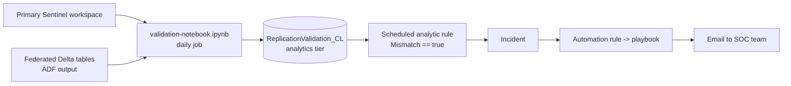

# Additional information

Supporting reference material for the BCDR replication validation. For setup, start with
[README.md](README.md).

- [How the validation works](#how-the-validation-works)
- [The result table](#the-result-table)
- [Why event time, not ingestion time](#why-event-time-not-ingestion-time)
- [Table name matching (primary vs federated)](#table-name-matching-primary-vs-federated)
- [Tuning](#tuning)
- [Cost](#cost)
- [Security notes](#security-notes)
- [Troubleshooting](#troubleshooting)

## How the validation works

The [parent ADF pipeline](../README.md) replicates Azure Monitor export blobs from one region into
**Delta tables** in another region, which are then surfaced in the Microsoft Sentinel data lake as
**federated tables**. This validation answers one question: *did every event make it across?*

[validation-notebook.ipynb](validation-notebook.ipynb) runs as a daily notebook job and, for the
**full previous 24 h (UTC)**:

1. Lists the tables in the **primary workspace** (`list_tables(PRIMARY_WORKSPACE_NAME)`) and the
   **federated** tables (`list_tables()` against the System tables database).
2. Matches each primary table to its federated copy by base name.
3. Counts events on both sides filtered on `TimeGenerated` within the window.
4. Computes `GapPercentage = |primary - parquet| / primary * 100` and sets
   `Mismatch = GapPercentage > GAP_TOLERANCE_PERCENT` (default tolerance `0.0`, so any difference is
   a mismatch).
5. Appends one row per table to the analytics-tier table `ReplicationValidation_CL`.

The analytic rule then filters that table for `Mismatch == true` and raises an Informational
incident; the automation rule runs the playbook, which emails the SOC team.

## The result table

`ReplicationValidation_CL` columns:

| Column | Type | Meaning |
| --- | --- | --- |
| `Table` | string | Source table name. |
| `NumEventsInPrimaryWorkspace` | long | Event count in the primary workspace for the window. |
| `NumEventsInParquetFiles` | long | Event count in the federated Delta table for the window. |
| `GapPercentage` | double | `|primary - parquet| / primary * 100`. |
| `Mismatch` | bool | `true` when the gap exceeds the tolerance. |
| `TimeGenerated` | datetime | When the validation ran. |
| `WindowStartUtc` / `WindowEndUtc` | datetime | The 24 h window that was validated. |

`GapPercentage` is stored as a number (e.g. `5.0`), not the string `"5 %"`, so the analytic rule and
ad-hoc KQL can apply numeric thresholds. The notebook writes **all** evaluated tables every day (not
only mismatches) so you keep a full daily history of healthy and unhealthy runs; the analytic rule
filters for `Mismatch == true`.

> The analytics tier is **append-only** from a notebook (`save_as_table` supports `append` only for
> `_SPRK_CL` tables). That is intentional here — each daily run adds rows rather than overwriting.

## Why event time, not ingestion time

The federated Delta tables carry an `IngestedUtc` column (the time ADF wrote the rows) **and** the
original `TimeGenerated` event time. The validation counts on `TimeGenerated` on both sides so it is a
true apples-to-apples comparison: a given day's events are counted in the same bucket regardless of
when ADF happened to process them. Counting on ingestion time would create false mismatches simply
because the hourly ADF run straddles midnight.

Run the job a few hours after midnight UTC (and keep the ADF `processingDelayHours` in mind) so all of
yesterday's events have been exported and converted before you compare.

## Table name matching (primary vs federated)

Federated tables are named `<table>_<federationInstanceName>` (for example `SigninLogs_bcdr`). The
notebook builds a map from base name to federated table:

- If `FEDERATION_INSTANCE_NAME` is set, it matches tables ending in `_<instance>` and strips that
  suffix — reliable, and the recommended approach.
- If left blank, it falls back to treating the text before the last underscore as the base name. This
  is best effort and can mis-match tables whose names contain underscores, so set the instance name
  explicitly in production.

Matching is case-insensitive. A table only appears in the comparison when it exists on **both** sides,
so tables that aren't part of the Data Export rule are simply skipped.

## Tuning

| Parameter (notebook) | Default | Effect |
| --- | --- | --- |
| `GAP_TOLERANCE_PERCENT` | `0.0` | Raise to tolerate small in-flight gaps (e.g. `1.0`). |
| `LOOKBACK_DAYS` | `1` | Validate further back if the ADF copy lags by more than a day. |
| `TABLE_ALLOWLIST` | `[]` | Restrict to specific tables (useful for a quick test). |
| `TIME_COLUMN` | `TimeGenerated` | Change only if your schema uses a different event-time column. |

Analytic rule severity is **Informational** (lowest priority), as requested. Change `severity` in
[azuredeploy.json](azuredeploy.json) if you want it to stand out more.

## Cost

- **Notebook job compute** — a daily Spark job on the Medium pool. Cost scales with the number of
  tables and their daily volume; counting is a cheap aggregation but still reads each table. Run once
  per day, off-peak.
- **Playbook** — Logic App consumption pricing; a handful of runs per day at most (only on mismatch).
- **Analytic rule** — no extra charge beyond standard Sentinel analytics.

The dominant replication cost remains the ADF pipeline itself — see the parent
[ADDITIONAL-INFORMATION.md](../ADDITIONAL-INFORMATION.md#cost-estimations).

## Security notes

- The playbook uses two **API connections** (`office365`, `azuresentinel`) that must be authorized
  interactively after deployment. The Office 365 connection sends mail **as the account that
  authorizes it** — use a dedicated, least-privileged mailbox, not a personal account.
- The Microsoft Sentinel connection uses **managed identity** authentication; grant the playbook's
  managed identity only the Sentinel role it needs (Microsoft Sentinel Responder is enough to read
  incident details).
- `azuredeploy.parameters.json` (your filled-in copy, which contains the SOC address) is git-ignored.
- No secrets are stored in the notebook or templates.

## Troubleshooting

### The notebook writes nothing ("No tables were evaluated")

The primary/federated match set is empty. Confirm `PRIMARY_WORKSPACE_NAME` with
`data_provider.list_databases()`, set `FEDERATION_INSTANCE_NAME` to the exact connector instance name,
and check that the federated tables are visible under **System tables → Federated tables** in the
Sentinel extension.

### `ReplicationValidation_CL` doesn't appear in Logs

The data lake managed identity (`msg-resources-<guid>`) needs **Log Analytics Contributor** on the
analytics-tier workspace to create the custom table. Assign it, then rerun the notebook. New custom
tables can take a few minutes to become queryable.

### The analytic rule never fires

Confirm the table name matches `resultTableName` (some tenants surface the table under a slightly
different name). Open **Logs**, run `ReplicationValidation_CL | take 10`, and align the
`resultTableName` parameter, then redeploy. Also check the rule is **enabled** and that at least one
row has `Mismatch == true` within the rule's 1-day window.

### No email is sent

Almost always an unauthorized connection or missing playbook permission. Re-open both API connections
and click **Authorize → Save**, and in **Sentinel → Automation** grant the playbook permissions on its
resource group. Check the Logic App **Run history** for the failed action.

### Counts mismatch but data looks fine

Late-arriving data: the ADF copy for the last hour(s) of the day may not have completed when the job
ran. Increase the gap between midnight UTC and the job start time, raise `GAP_TOLERANCE_PERCENT`
slightly, or increase the parent pipeline's `processingDelayHours`.
